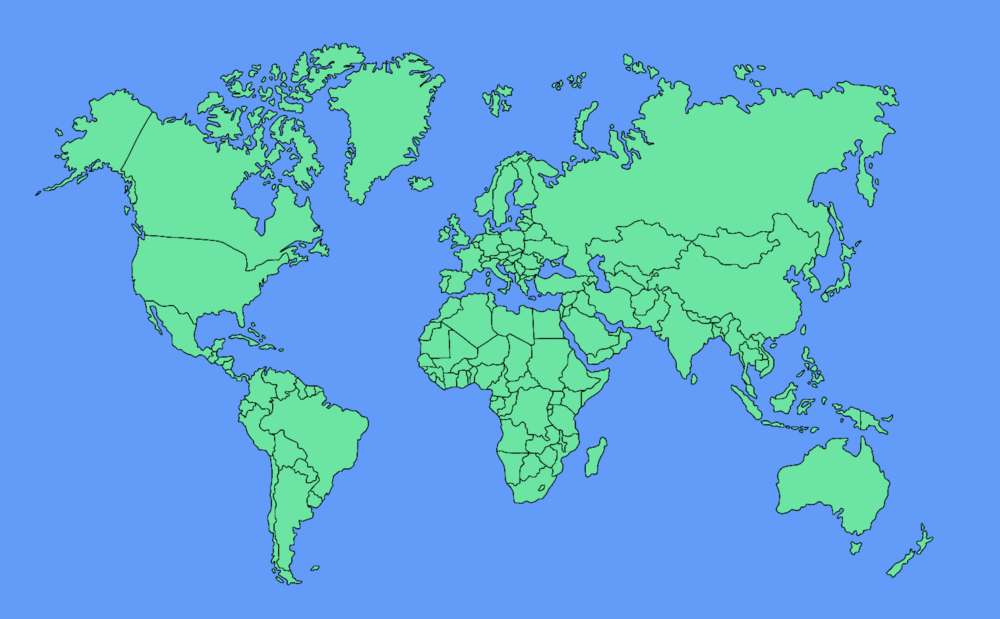

<!DOCTYPE html>
<html lang="en">
  <head>
    <meta charset="utf-8" />
    <meta name="viewport" content="width=device-width,initial-scale=1" />
    <title>NASA - Will It Rain On My Parade?</title>
    
  </head>
  <body>
    

      <h1>WEPI - Climate Explorer</h1> 
      

        Search by city name → Uses NASA POWER daily data from 01/01/2001 ~ 12/31/2024 to calculate average values for the selected month and day.
         Parameters: <a href="https://power.larc.nasa.gov/data-access-viewer/" target="_blank" rel="noopener noreferrer">https://power.larc.nasa.gov/data-access-viewer/</a> 
        ☀️ Temperature at 2 Meters 
        🌧️ Precipitation Corrected 
        💨 Wind Speed at 2 Meters 
        💦 Relative Humidity at 2 Meters
      

      

      

        <input
          id="city"
          placeholder="Enter city name (e.g., Seoul, Paris, New York)"
          style="flex: 2"
        />
        <select id="month">
          <option value="01">January</option>
          <option value="02">February</option>
          <option value="03">March</option>
          <option value="04">April</option>
          <option value="05">May</option>
          <option value="06">June</option>
          <option value="07">July</option>
          <option value="08">August</option>
          <option value="09">September</option>
          <option value="10">October</option>
          <option value="11">November</option>
          <option value="12">December</option>
        </select>
        <select id="day">
          
        </select>

        <button id="btn" onclick="run()">Search</button>
        

          Loading data...
        

      

      

        

          <h3 style="margin: 6px 0">Results:</h3>
          
Summary will appear here after search.

        

      

      <!-- 여기에 이미지 넣기 -->
      

        
      

    

    
  </body>
</html>
